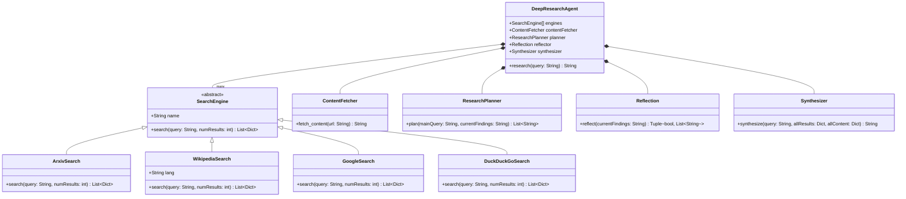
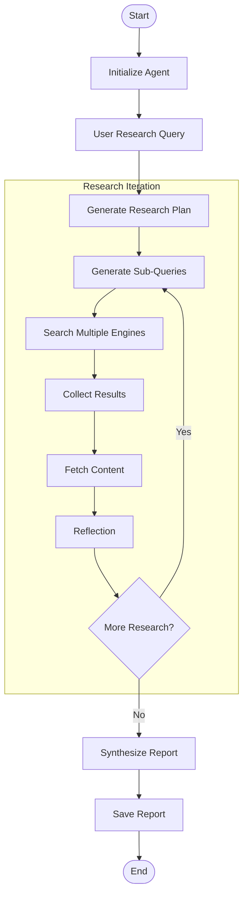

# deepsearch-agent
Simple DeepSearch agent based on openai compatible llm model

## features
This DeepSearch-Agent is a demo search agent designed to perform comprehensive information gathering and synthesis. No any agent framework used for simpility. Its primary purposes are:

1. **Automated Research**: Conduct multi-source research on a given topic with minimal user intervention
2. **Iterative Exploration**: Explore a topic through multiple iterations, refining searches based on findings
3. **Content Synthesis**: Generate coherent, well-structured reports that summarize findings from diverse sources
4. **Intelligent Planning**: Use AI to determine the most relevant sub-queries to explore a topic thoroughly

The agent leverages multiple search engines, content extraction techniques, and AI-powered planning, reflection, and synthesis to create a complete research workflow.

## Components Overview

The DeepSearch-Agent consists of several key components that work together to perform comprehensive research:

### Core Components

1. **Search Engines** - Abstract and concrete implementations of various search providers
2. **Content Fetcher** - Extracts meaningful content from web pages
3. **Research Planner** - Uses AI to generate effective sub-queries
4. **Reflection Component** - Evaluates research quality and suggests improvements
5. **Synthesizer** - Creates a coherent final report from gathered information
6. **DeepResearchAgent** - Main orchestrator that coordinates the research process

### External Dependencies

1. **Search APIs**:
   - arXiv for academic papers
   - Wikipedia for encyclopedic knowledge
   - DuckDuckGo for web search
   - Google for web search

2. **AI Integration**:
   - Azure OpenAI for planning, reflection, and synthesis
   - Placeholder implementations as fallback

### External Dependencies

1. **Search APIs**:
   - arXiv for academic papers
   - Wikipedia for encyclopedic knowledge
   - DuckDuckGo for web search
   - Google for web search

2. **AI Integration**:
   - Azure OpenAI for planning, reflection, and synthesis
   - Placeholder implementations as fallback

## Component Diagram



## Workflow Diagram



## Key APIs and Methods

### DeepResearchAgent
- `__init__(engines, max_iterations, fetch_top_n_content)` - Initializes the agent with search engines and parameters
- `research(query, num_results_per_engine)` - Main entry point that orchestrates the research process

### SearchEngine (Abstract)
- `search(query, num_results)` - Abstract method that all search engines must implement

### Engine Implementations
- `ArxivSearch.search(query, num_results)` - Searches academic papers on arXiv
- `WikipediaSearch.search(query, num_results)` - Searches Wikipedia articles
- `GoogleSearch.search(query, num_results)` - Searches the web using Google
- `DuckDuckGoSearch.search(query, num_results)` - Searches the web using DuckDuckGo

### LLM Integration
- `llm_plan(query, current_findings)` - Uses Azure OpenAI to plan research strategy
- `llm_synthesize(query, all_results, all_content)` - Uses Azure OpenAI to create the final report
- `llm_reflect(current_findings)` - Uses Azure OpenAI to evaluate research and suggest improvements

### Content Management
- `ContentFetcher.fetch_content(url)` - Extracts meaningful content from a webpage
- `fetch_webpage_content_api(url, max_length)` - Low-level function to fetch and clean webpage content

## Configuration

The agent uses several configurable parameters:
- `DEFAULT_NUM_RESULTS` - Number of results to retrieve per search engine (default: 3)
- `MAX_ITERATIONS` - Maximum research iterations (default: 3)
- `MAX_TOTAL_RESULTS` - Maximum total results across all iterations (default: 20)
- `FETCH_DELAY_RANGE` - Range for random delays between fetches (default: 0.5-1.5 seconds)
- `DEFAULT_TIMEOUT` - HTTP request timeout (default: 10 seconds)

## how to use
### clone the repo
```
git clone https://github.com/flyingcloud-code/deepsearch-agent
cd deepsearch-agent
```
### set up virtual env
```
uv venv
```
#### windows
```
.venv\Scripts\activate  # windows
```
#### linux
```
source .venv/Scripts/activate  #linux
```

## install module
```
uv pip install -r requirements.txt
```

### setup llm
```
cp .env.example .env
```
Update key/base url as needed

### execute agent

- update topic in main function
```
research_topic = "in LLM, what is decoder-only model and what is attention?"
```
- run
```
python deepsearch-agent.py
```
